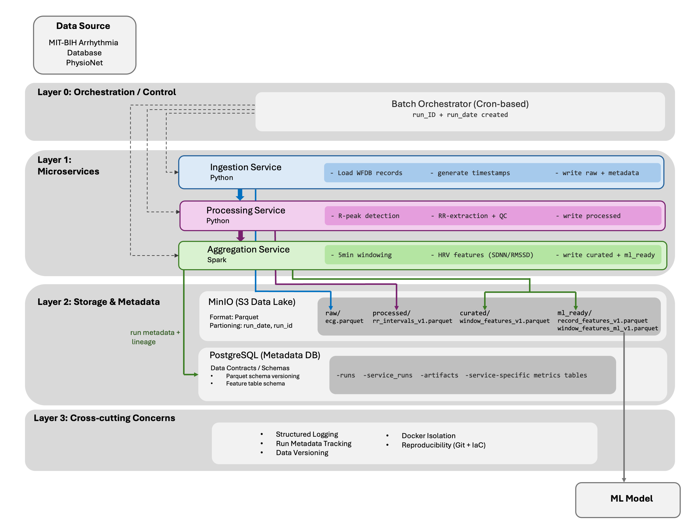

# ECG HRV Feature Pipeline

Reproducible batch pipeline that converts ECG recordings into heart rate variability (HRV) features and produces machine-learning-ready feature datasets.

## Overview

This project processes ECG time-series data through a layered data pipeline:

`raw ECG -> RR intervals -> HRV windows -> ML-ready feature datasets`

The system ingests ECG recordings, performs R-peak detection and RR-interval extraction, computes 5-minute HRV statistics, and writes two ML-ready outputs: a primary window-level modeling table and a secondary record-level baseline table.

The pipeline is implemented as containerized microservices and runs as a reproducible batch process using Docker.

All datasets are stored as Parquet in an S3-compatible object store (MinIO) and registered in PostgreSQL metadata tables for lineage and discovery.

## Project Goals

This project demonstrates how to design a reproducible biomedical data pipeline with:

- layered data architecture (`raw -> processed -> curated -> ml_ready`)
- explicit data contracts and schema versioning
- reproducible batch processing using containerized services
- metadata-driven artifact tracking and lineage
- contract tests that enforce pipeline invariants

**Key capabilities**

- Ingest ECG recordings from the MIT-BIH Arrhythmia Database (WFDB format)
- Detect R-peaks and compute RR interval series
- Generate 5-minute HRV feature windows
- Produce ML-ready feature representations:
  - window-level temporal features for sequence-aware modeling
  - record-level aggregated baseline features
- Track data lineage and artifacts via PostgreSQL metadata
- Execute the pipeline reproducibly using containerized services

**Stack:** Python · Apache Spark (PySpark) · Docker · MinIO · PostgreSQL

## Pipeline Architecture

[](docs/architecture_diagram.png)

*Click the image to view the full-resolution architecture diagram.*

```text
raw ECG
   |
   v
ingestion
   |
   v
processing
   |
   v
aggregation
   ├─ curated/window_features_v1      (HRV windows)
   ├─ ml_ready/window_features_ml_v1  (primary modeling dataset)
   └─ ml_ready/record_features_v1     (record-level baseline)
```

The window-level ML dataset (`window_features_ml_v1`) is the primary modeling representation because arrhythmia tasks operate on temporal segments rather than full-record aggregates.

| Data stage | Purpose |
|---|---|
| `raw` | Original ECG waveform data |
| `processed` | RR intervals extracted from ECG |
| `curated` | 5-minute HRV feature windows |
| `ml_ready` | Machine-learning-ready feature datasets (window-level temporal + record-level aggregate) |

Canonical artifacts by data stage:
- `processed`: `rr_intervals_v1`
- `curated`: `window_features_v1`
- `ml_ready`: `window_features_ml_v1` (primary), `record_features_v1` (secondary)

## ML-Ready Outputs

The pipeline produces two complementary ML-ready datasets: a window-level temporal representation used for most modeling tasks, and a record-level aggregated baseline.
Both datasets are derived from curated 5-minute HRV windows and registered as versioned artifacts in the metadata catalog.

### `window_features_ml_v1` (primary temporal representation)

Path:

`ml_ready/run_date=.../run_id=.../window_features_ml_v1.parquet/`

One row per 5-minute window (`run_id`, `record_id`, `window_start_sec`), preserving within-record temporal variation for arrhythmia-style and sequence-aware modeling.
Row grain: (`run_id`, `record_id`, `window_start_sec`).

### `record_features_v1` (secondary record-level baseline representation)

Path:

`ml_ready/run_date=.../run_id=.../record_features_v1.parquet/`

Each row corresponds to one ECG record and contains aggregated HRV metrics derived from RR intervals.
Row grain: (`run_id`, `record_id`).

### Window-Level ML Features (`window_features_ml_v1`)
These features describe HRV behavior within each 5-minute window.

- `mean_rr_ms`
- `sdnn_ms`
- `rmssd_ms`
- `pnn50`
- `n_rr`
- `heart_rate_bpm`
- `rr_cv`
- `rmssd_sdnn_ratio`
- `window_valid`
- `window_coverage_sec`
- `window_is_partial`

### Record-Level Aggregated Features (`record_features_v1`)
These features summarize HRV statistics across all windows of a record.

#### Core HRV Metrics

- `mean_rr_ms`
- `sdnn_ms`
- `rmssd_ms`
- `pnn50`

#### Derived Cardiovascular Indicators

- `heart_rate_bpm`
- `rr_cv`
- `rmssd_sdnn_ratio`

#### RR Distribution Statistics

- `rr_min_ms`
- `rr_max_ms`
- `rr_range_ms`
- `rr_median_ms`
- `rr_iqr_ms`

#### Beat-to-Beat Irregularity Metrics

- `sdsd_ms`
- `pnn20`

#### Temporal Stability Across Windows

- `mean_rr_window_std`
- `sdnn_window_std`
- `rmssd_window_std`

#### Data Quality and Coverage Indicators

- `window_count_total`
- `window_count_valid`
- `valid_window_fraction`
- `mean_window_coverage_sec`
- `min_window_coverage_sec`
- `partial_window_fraction`

## Idempotency

Aggregation enforces strict dual-output idempotency semantics when `AGG_OVERWRITE=false`:

| State of ml_ready outputs | Behavior |
|---|---|
| both exist (`record_features_v1` and `window_features_ml_v1`) | skip |
| none exist | run aggregation |
| exactly one exists | fail (partial state) |

This prevents inconsistent ML-ready states where only one of the two outputs exists.

## Dataset Setup (MIT-BIH Arrhythmia Database)

### Dataset Source

This pipeline is designed to process ECG recordings from the MIT-BIH Arrhythmia Database:

- [MIT-BIH Arrhythmia Database (PhysioNet)](https://physionet.org/content/mitdb/1.0.0/)

The dataset contains 48 half-hour ambulatory ECG recordings sampled at 360 Hz and distributed in WFDB format.
The ingestion service reads WFDB files (`.dat`, `.hea`, `.atr`) using the Python WFDB library.

### Download the Dataset

Download and extract the dataset from PhysioNet locally.  
The full MIT-BIH dataset contains 48 recordings, but the pipeline can be tested with a small subset.  
For an initial run, records `100`, `101`, and `102` are sufficient.

### Place the Dataset in the Expected Directory

From the repository root (`ecg-batch-platform/`), create the dataset folder:

```bash
mkdir -p data/mitdb
```

This command creates `data/mitdb/` relative to the repository root.

Place downloaded WFDB files inside:

`data/mitdb/`

Example structure:

```text
data/
  mitdb/
    100.dat
    100.hea
    100.atr
    101.dat
    101.hea
    101.atr
```

Docker Compose mounts this directory into containers as:

`/data/mitdb`

## Environment Setup

Requirements:
- Docker
- Docker Compose
- Linux or macOS shell

Initialize environment:

```bash
cp .env.example .env
docker compose up -d
```

## Environment Check

Before running the pipeline, confirm infrastructure containers are running:

```bash
docker compose ps
```

Expected services:
- `postgres`
- `minio`

If they are not running, start them with:

```bash
docker compose up -d
```

## Quick Start: Run the Pipeline on Real ECG Data

Use one `RUN_ID`/`RUN_DATE` consistently across all stages.
`RUN_ID` and `RUN_DATE` uniquely identify a pipeline execution and are used for dataset partitioning and metadata lineage.

Recommended first real-data run:
- `USE_SYNTHETIC_DATA=false`
- `RECORD_IDS=100,101,102`

### Run via Orchestrator (Recommended)

```bash
RUN_ID=mitdb_demo_01 \
RUN_DATE=2026-03-06 \
USE_SYNTHETIC_DATA=false \
RECORD_IDS=100,101,102 \
./scripts/run_orchestrator.sh
```

### Manual Execution (Optional)

```bash
RUN_ID=mitdb_demo_01 RUN_DATE=2026-03-06 USE_SYNTHETIC_DATA=false RECORD_IDS=100,101,102 docker compose run --rm ingestion
RUN_ID=mitdb_demo_01 RUN_DATE=2026-03-06 RECORD_IDS=100,101,102 docker compose run --rm processing
RUN_ID=mitdb_demo_01 RUN_DATE=2026-03-06 RECORD_IDS=100,101,102 docker compose run --rm aggregation
```

## Verify Results

### Check Service Execution

```bash
docker compose exec postgres psql -U ecg -d ecg_metadata -c \
"SELECT run_id, status FROM runs WHERE run_id='mitdb_demo_01';"
```

```bash
docker compose exec postgres psql -U ecg -d ecg_metadata -c \
"SELECT run_id, service, status FROM service_runs WHERE run_id='mitdb_demo_01' ORDER BY service;"
```

Expected successful statuses:
- `runs.status -> succeeded` (ingestion)
- `processing -> succeeded`
- `aggregation -> succeeded`

### Check Produced Artifacts

```bash
docker compose exec postgres psql -U ecg -d ecg_metadata -c \
"SELECT layer, artifact_type, schema_ver, record_id FROM artifacts WHERE run_id='mitdb_demo_01' ORDER BY layer, record_id;"
```

Expected artifact coverage includes:
- `processed / rr_intervals_v1`
- `curated / window_features_v1`
- `ml_ready / window_features_ml_v1`
- `ml_ready / record_features_v1`

### Inspect Primary ML-Ready Output

To inspect the primary modeling dataset (`ml_ready/window_features_ml_v1`) for the demo run:

```bash
docker compose run --rm processing python scripts/preview_window_ml.py \
  --run-id mitdb_demo_01 \
  --run-date 2026-03-06 \
  --record-id 100 \
  --limit 3
```

This prints the first up to 3 windows for the selected record (for example `window_start_sec = 0, 300, 600` when available).

## Canonical Data Contracts

Canonical schemas, derivation rules, and invariants:
- `docs/CANONICAL_DATA_CONTRACT.md`

System architecture and technical specification:
- `docs/ECG_PIPELINE_ARCHITECTURE_AND_DATA_CONTRACT.md`

## Contract Tests (Optional)

```bash
./scripts/contract_test_gate_a.sh
./scripts/contract_test_gate_b.sh
./scripts/contract_test_gate_c.sh
```

These tests validate canonical artifact contracts, semantic checks, invariants, and idempotency behavior.

## Synthetic Data Mode (Optional)

Synthetic mode is available for quick smoke tests without downloading MIT-BIH data:

```bash
RUN_ID=synth_demo RUN_DATE=2026-03-06 ./scripts/run_orchestrator.sh
```

Synthetic mode is intended for rapid local testing; real ECG data should be used to assess semantic correctness of HRV feature computation.

## Repository Structure

```text
docker-compose.yml
.env.example

services/
  ingestion/      # WFDB ECG ingestion
  processing/     # R-peak detection and RR interval extraction
  aggregation/    # HRV window features and ML-ready datasets

docs/
  architecture_diagram.png
  ECG_PIPELINE_ARCHITECTURE_AND_DATA_CONTRACT.md
  CANONICAL_DATA_CONTRACT.md

scripts/
  run_orchestrator.sh
  preview_window_ml.py
  contract_test_gate_a.sh
  contract_test_gate_b.sh
  contract_test_gate_c.sh
```

## Additional Documentation

Service-specific implementation details:
- `services/ingestion/README.md`
- `services/processing/README.md`
- `services/aggregation/README.md`
